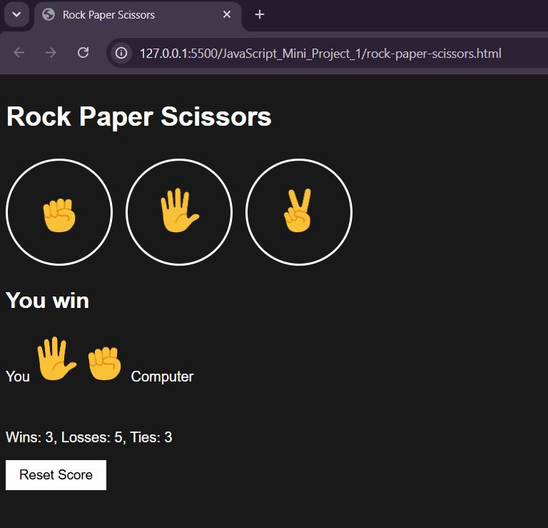

# Rock Paper Scissors Game

## Description

A simple Rock Paper Scissors game built using HTML, CSS, and JavaScript. The player competes against the computer, and the winner is decided based on the standard game rules.

## Features

* Play against the computer
* Random computer choice generation
* Displays game result after every round
* Score tracking
* Responsive and user-friendly interface

## Technologies Used

* HTML
* CSS
* JavaScript

## How to Run

1. Download or clone the project.
2. Open `rock-paper-scissors.html` in any modern web browser.
3. Start playing.

## Future Improvements

* Add sound effects
* Add animations

## Screenshot

